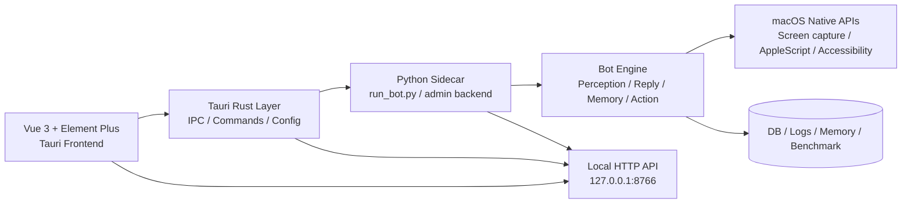

# WeChat Mac RPA 迁移方案（方案 A）

> 目标：保留 Python 业务层，使用 Tauri + Vue 3 + Element Plus 作为桌面前端与控制层，形成“Python 核心引擎 + Tauri 桌面壳”的双层架构。

---

## 1. 总体思路

本项目的本质不是传统 Web 应用，而是一个基于 macOS 自动化能力、视觉感知、LLM 和本地记忆的机器人系统。核心逻辑已集中在：

- [run_bot.py](run_bot.py)
- [rpa/bot/wechat_bot.py](rpa/bot/wechat_bot.py)
- [rpa/perception/smart_pipeline.py](rpa/perception/smart_pipeline.py)
- [tools/server/admin.py](tools/server/admin.py)

这些模块承载了：

- 微信窗口截图与结构化识别
- 多轮消息循环与发送
- LLM 生成回复
- 记忆与检索
- benchmark / review / audit
- macOS native 自动化能力

因此，最稳妥的迁移策略不是“重写成纯 Tauri”，而是：

- Tauri 负责桌面应用和前端 UI
- Python 继续负责真实业务与 native 交互
- Rust 作为桥接层，启动和管理 Python 进程，并连接前端状态/日志

这正是方案 A：Tauri + Python sidecar。

---

## 2. 迁移原则

1. 不破坏现有业务能力
   - 现有 Python 代码尽量不动，先抽离 API 和控制接口。
2. UI 与业务分离
   - 前端只负责展示与交互，真正的执行逻辑留在 Python。
3. 逐步迁移
   - 先做控制台，再做看板，再做高级管理页面。
4. 保持 macOS 兼容
   - 权限检查与系统控制继续保留在 native 层或 Python 层。
5. 先可用，再完善
   - 先做到“能启动、能停止、能看日志、能管理配置”，再做高级功能。

---

## 3. 目标架构



### 3.1 组件职责

#### Tauri 前端（Vue + Element Plus）
- 启动/停止机器人
- 读取配置文件
- 展示日志
- 运行 benchmark
- 查看截图、评审记录和审计信息
- 提供桌面风格设置与状态栏界面

#### Tauri Rust 层
- 管理 Python 子进程
- 处理桌面应用启动逻辑
- 调用本地命令
- 维护配置与状态
- 连接前端与 Python sidecar

#### Python backend
- 保留所有已有业务代码
- 处理消息循环、OCR、记忆、ReplyGenerator
- 直接控制微信窗口和系统行为
- 对外暴露 REST API 或本地进程接口

---

## 4. 技术选型

### 4.1 前端技术

- Vue 3
- Vite
- TypeScript
- Element Plus
- Pinia（状态管理）
- Axios（HTTP）
- @tauri-apps/api（Tauri 交互）

### 4.2 后端技术

- Python 3.10+
- FastAPI（继续保留，作为 local backend）
- SQLite / JSON / 本地文件缓存
- 现有模块和脚本保持不变

### 4.3 桥接方式

优先使用：

- Tauri Rust 调用 Python subprocess
- Python 侧继续暴露本地 HTTP API
- 前端通过 `fetch` 调用 `http://127.0.0.1:8766`

同时保留：

- Tauri `invoke` / command 作为更原生的控制接口
- 对于桌面级操作（启动/停止/状态）优先走 Rust commands

---

## 5. 目标目录结构

```text
wechat-mac-rpa/
├─ app/                           # Tauri 前端（Vue + Element Plus）
│  ├─ rpa/
│  │  ├─ api/
│  │  ├─ components/
│  │  ├─ pages/
│  │  ├─ stores/
│  │  ├─ styles/
│  │  └─ App.vue
│  ├─ package.json
│  ├─ vite.config.ts
│  └─ index.html
├─ src-tauri/
│  ├─ rpa/
│  │  ├─ commands/
│  │  ├─ services/
│  │  ├─ lib.rs
│  │  └─ main.rs
│  ├─ Cargo.toml
│  └─ tauri.conf.json
├─ rpa/
│  ├─ bot/
│  ├─ memory/
│  ├─ perception/
│  ├─ reply/
│  ├─ action/
│  └─ utils/
├─ scripts/
│  ├─ admin.py
│  └─ ...
├─ data/
├─ run_bot.py
├─ requirements.txt
├─ pyproject.toml
├─ migrate.md
└─ README.md
```

---

## 6. 接口设计

### 6.1 Rust -> Python 控制接口

#### 启动机器人
- command: `start_bot`
- 参数：
  - `config_path`（可选）
  - `mode`（默认：ocr）
- 返回：
  - `status`: `started` / `already_running` / `failed`
  - `pid`
  - `message`

#### 停止机器人
- command: `stop_bot`
- 返回：
  - `status`: `stopped` / `not_running`

#### 获取状态
- command: `get_bot_status`
- 返回：
  - `running`
  - `pid`
  - `last_tick`
  - `model`
  - `wechat_status`

#### 日志读取
- command: `get_recent_logs`
- 参数：
  - `lines`: 200
- 返回：
  - `logs: string[]`

---

### 6.2 Python local HTTP API

保留现有 [tools/server/admin.py](tools/server/admin.py) 的 FastAPI 能力，并建议统一成下面接口：

- `GET /api/health`
- `GET /api/status`
- `POST /api/bot/start`
- `POST /api/bot/stop`
- `GET /api/logs?lines=200`
- `GET /api/ticks`
- `GET /api/review`
- `GET /api/screenshots`
- `GET /api/benchmark/summary`
- `GET /api/config`
- `POST /api/config/save`

### 6.3 前端访问方式

前端优先使用 Vue + Element Plus 组件调用：

```ts
// 示例：状态查询
const res = await fetch('http://127.0.0.1:8766/api/status');
const data = await res.json();
```

对于前端更直观的桌面交互，建议再用 Tauri command 封装：

```ts
import { invoke } from '@tauri-apps/api/core';

const status = await invoke('get_bot_status');
```

---

## 7. Vue + Element Plus 前端页面拆分

### 7.1 页面清单

1. Dashboard
   - 运行状态
   - 今日 tick
   - 回复数量
   - 平均 judge score
   - 系统健康状态

2. Bot Control
   - 启动/停止
   - 重启
   - 一键检查权限
   - 设置轮询间隔

3. Logs
   - 实时日志
   - 过滤器
   - 复制日志
   - 导出日志

4. Benchmark
   - 运行 OCR benchmark
   - 打开报告
   - 查看指标图表

5. Review / Badcase
   - 查看人工 review
   - 标注 badcase
   - 与数据库对接

6. Screenshot / OCR
   - 查看图片列表
   - 批量 OCR
   - 点击查看放大图

7. Settings
   - LLM 配置
   - API Key
   - timeout
   - 自动重试
   - 聊天黑名单

---

## 8. 迁移分阶段

### 阶段 1：抽离控制接口（1-2 周）

目标：不改业务逻辑，先接通 UI 控制通道。

任务：
- 整理现有 [tools/server/admin.py](tools/server/admin.py) API
- 增加 `/api/status`, `/api/logs`, `/api/bot/start`, `/api/bot/stop`
- 保证 Python 进程单例运行
- 验证接口稳定

产出：
- 后端接口可用
- Tauri 前端可以连接到这些接口

---

### 阶段 2：搭建 Tauri 桌面壳（1 周）

目标：有一个真正的桌面应用窗口。

任务：
- 初始化 Tauri + Vue 3 + Element Plus 项目
- 使用 Element Plus 做页面布局
- 实现 sidebar + topbar + main content
- 集成 API 请求基类

产出：
- 可启动的桌面窗口
- 能显示状态和 logs

---

### 阶段 3：迁移动效看板与状态页面（1 周）

任务：
- Dashboard 迁移
- Bot Control 页面
- Logs 页面
- 配置页

重点：
- 先保证数据展示流畅
- 再做用户体验细节

---

### 阶段 4：迁移审计与 benchmark（1-2 周）

任务：
- benchmark 页面
- review 页面
- badcase 页面
- OCR screenshot 页面

目标：
- 把脚本的数据可视化
- 让用户不必再通过命令行管理

---

### 阶段 5：权限与发布（1 周）

任务：
- macOS 权限检测
- 自动化权限提示
- 打包与发布方案
- 安装引导页

产出：
- 能直接运行的 Macintosh 桌面应用

---

## 9. 关键实现注意事项

### 9.1 单例控制
当前 [run_bot.py](run_bot.py) 已经包含单实例锁逻辑，应该继续保留。Tauri 侧也需要做同样的控制，以避免重复启动多个 Python bot。

建议：
- Rust 层保留一份 `bot.pid` 监控
- Python if running -> 返回 `already_running`
- Tauri UI 统一显示“已在运行”状态

### 9.2 日志流
现在日志文件通常是本地持久化文件，建议：

- Python 统一写入 `logs/` 目录
- Tauri 读取日志文件尾部输出
- 前端通过轮询或 SSE 拉取

优先采用：
- `GET /api/logs?lines=200`
- 适合桌面应用简单稳定

### 9.3 权限检查
项目 README 中明确要求检查：

- 屏幕录制
- 辅助功能
- 应用自动化权限

Tauri 应该在启动前暴露检查入口，例如：

- `check_macos_permissions()`
- 打开系统设置页
- 关键提示：
  - 需要真实用户登陆
  - 不要直接在自动化环境中无权限运行

---

## 10. 迁移的风险

### 10.1 过度重构
风险：
- 一次性把 Python 模块全部重写到 Rust / JS
- 成本过大，且不必要

解决：
- 保持 Python 原有逻辑不动，优先做 UI 层与控制层

### 10.2 进程管理复杂
风险：
- bot 运行时，前端进程和 python 进程状态不同步

解决：
- 使用状态文件 + 统一状态 API
- Rust 层推送状态更新

### 10.3 权限问题
风险：
- 用户在无权限的环境运行，导致微信交互失败

解决：
- UI 上提前提醒
- 自动化检查页
- 日志明确输出权限问题

---

## 11. 建议的落地顺序

建议按下面顺序推进：

1. 保留 Python 核心引擎不动
2. 抽离 admin.py API
3. 搭建 Tauri + Vue + Element Plus shell
4. 实现启动/停止/日志
5. 实现 Dashboard / Config
6. 迁移 benchmark 与 review
7. 增加权限检查和打包

这是一条“稳健且可验证”的路线，不会导致项目大规模中断。

---

## 12. 阶段计划（执行版）

### 阶段 0：准备环境（已开始）

- 验证 Node / npm / Rust / Cargo 环境
- 修复本机 Rust 依赖异常
- 确认 Tauri 所需工具链可用
- 记录构建和运行的最小验证命令

### 阶段 1：初始化 Tauri + Vue 前端骨架

- 在仓库中创建 `app/` 子目录
- 运行 Tauri Vue 模板
- 安装前端依赖
- 确认 `npm run tauri dev` 可启动桌面窗口
- 建立基础布局：Sidebar / Topbar / Content

### 阶段 2：搭建 Python backend API 层

- 在 `rpa/backend/` 下实现基础 FastAPI app
- 提供 `/api/health`、`/api/status`、`/api/logs`、`/api/bot/start` 与 `/api/bot/stop`
- 统一日志目录与状态持久化路径
- 桌面控制 API 使用 `127.0.0.1:8767`，与现有管理后台 `8766` 并行
- 让 Tauri 前端能够直接请求本地 API

### 阶段 3：连接 Tauri 与 backend

- Rust command 启动 Python sidecar
- Rust command 读取 status 和日志
- 利用 Vue store 管理状态与刷新逻辑
- 实现“启动/停止/状态查询/日志看板”最小闭环

当前进度：桌面 API、Bot 启停、状态轮询和日志读取已接通；Dashboard 已读取当日 Tick、回复数、平均 Judge 分与跳过率。日志视图已提供关键词筛选、复制和导出。设置、Benchmark、Review 与截图浏览仍待迁移。

### 阶段 4：迁移业务界面

- Dashboard：运行状态、处理数量、成功率
- Logs：实时日志、过滤、导出
- Settings：LLM / 配置 / 权限提示
- Benchmark：运行脚本并展示结果
- Review / Badcase：可视化审核入口
- Screenshot：图片浏览与 OCR 接口

### 阶段 5：权限与系统集成

- macOS 权限检测页
- 屏幕录制 / 辅助功能 / 自动化检查提示
- 运行前检查与错误提示
- 兼容现有 `README.md` 中的运行要求

### 阶段 6：发布与稳定性优化

- 打包桌面应用
- 处理启动失败、进程异常和日志缺失
- 统一配置文件
- 优化前端错误状态和用户提示

---

## 12. 最终结论

我们采用方案 A：Tauri + Python sidecar。

这意味着：

- Python 继续负责真实业务引擎
- Tauri 负责桌面壳与使用层
- Vue 3 + Element Plus 负责现代化前端体验
- Rust 用于控制和桥接

这个方案兼顾了：

- 不破坏当前工程
- 能快速进入桌面化
- 利于长期维护
- 对 macOS 自动化能力兼容性最好

它是当前项目最现实、最稳妥、最可落地的迁移方式。

---

## 13. 下一步动作建议

建议下一步直接执行：

1. 创建 `app/` 目录，初始化 Tauri + Vue 3 + Element Plus 工程
2. 先做一个最小可用前端：
   - left sidebar
   - topbar
   - dashboard
   - logs
   - start/stop button
3. 对接 Python backend 的 status / logs 接口
4. 再逐步把 benchmark、review、screenshots 页面迁移进来

这样可以在最短时间内，完成一个能用的桌面版控制台，而不会对机器人本体造成破坏。
